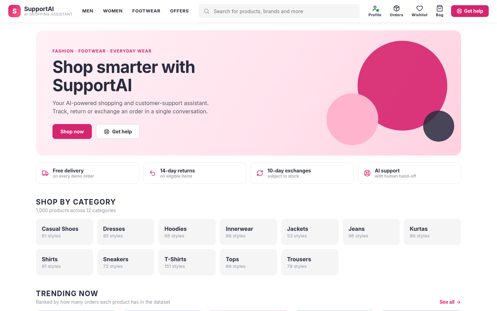
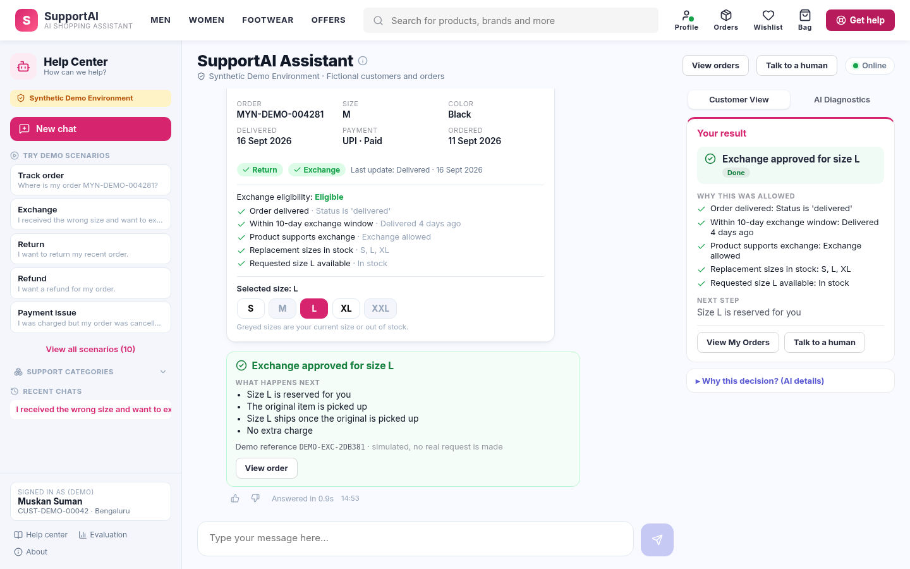
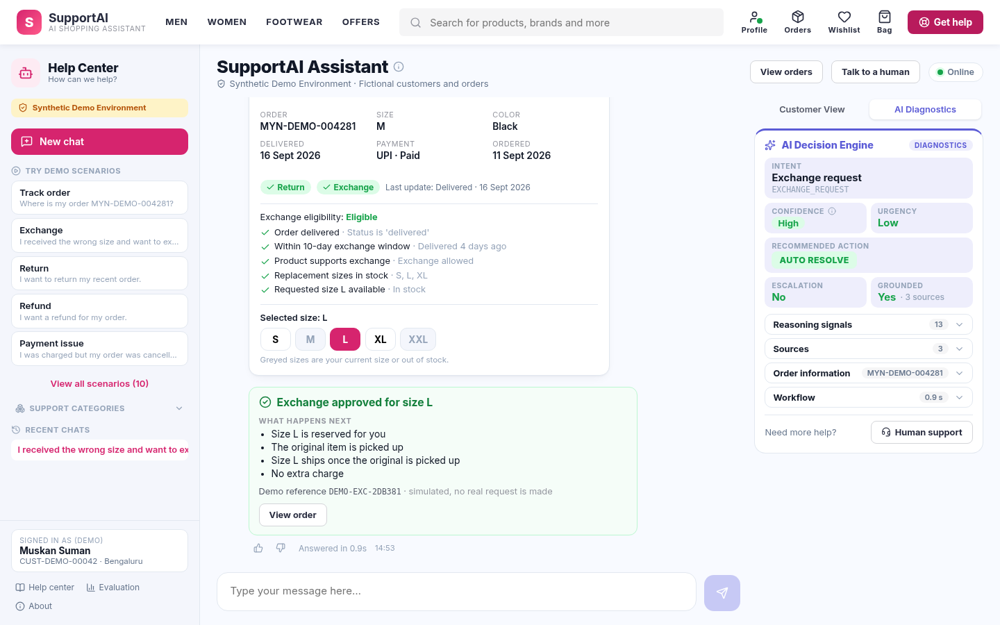
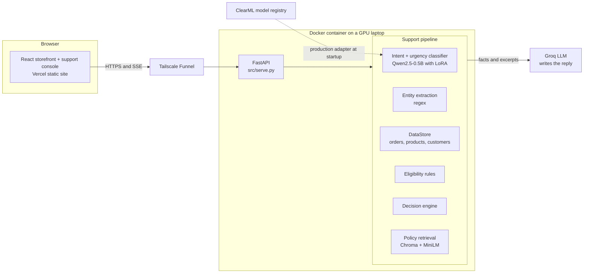
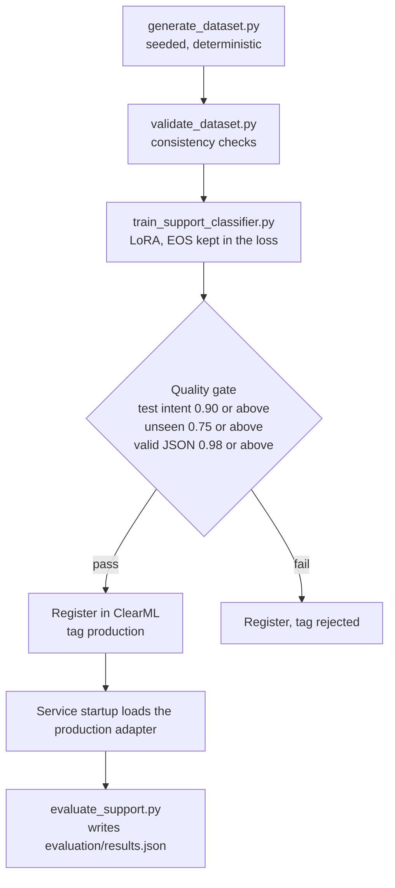

# SupportAI

**A fashion store with an AI customer-support agent built into it.**

A React storefront and a support console share one backend. A fine-tuned small model reads each customer message, deterministic code checks the order and the policy rules, and an LLM only writes the wording. Anything the model isn't sure about is turned into a question or handed to a human.

**Live demo:** https://supportai-demo.vercel.app

> **Synthetic Demo Environment.** Every customer, product and order is generated data with fictional brands. Actions such as returns, exchanges and escalations are simulated and carry `DEMO-` references. Nothing connects to a real store, and this project is not affiliated with any retailer.



| Customer View | AI Diagnostics |
|---|---|
|  |  |

## What it does

Ask *"I received the wrong size and want to exchange it"* and this happens:

1. A LoRA-fine-tuned **Qwen2.5-0.5B** classifies the intent and urgency. Its confidence comes from its own token probabilities.
2. The order is fetched from a **structured lookup**, never from the vector store.
3. **Plain rule functions** check eligibility: delivered? inside the 10-day window? is the size in stock?
4. A **decision engine** chooses to auto-resolve, ask a clarifying question, or escalate to a human.
5. **Policy passages** are retrieved from Chroma for grounding and citations.
6. An **LLM (Groq)** writes 2 to 4 sentences from those facts. It falls back to templates if the call fails.

The support page has two views of the same result. **Customer View** shows the outcome, why it was allowed, what happens next and any refund. **AI Diagnostics** shows intent, confidence band, urgency, recommended action, escalation, reasoning signals, sources and the timed workflow.

### Design rules

- **Never let the model state a fact it wasn't given.** Dates, sizes and eligibility come from lookups and rules. The prompt forbids inventing channels such as emails or phone numbers.
- **Urgency and escalation are separate.** An urgent tracking question still auto-resolves.
- **Confidence is a band, not a number.** The UI shows High, Medium or Low. Low confidence means "ask", not "guess".
- **Say only what is true about the demo.** Escalations are "prepared", never "connected".
- **Fail soft.** A classifier error becomes a clarifying question, an LLM error falls back to templates, and a missing backend shows a retry state.

## Architecture



Each message runs nine stages: understand, intent, confidence, urgency, order, eligibility, decision, knowledge, response. The UI streams them over server-sent events as each really finishes.

### Decision ladder

| Order | Condition | Outcome |
|---|---|---|
| 1 | Customer explicitly asks for a person | Escalate |
| 2 | Sensitive or legal language | Escalate |
| 3 | Low confidence (below 0.60) | Ask once, then escalate if still unclear |
| 4 | Medium confidence (0.60 to 0.84) | Confirm the intent before acting |
| 5 | Order-dependent intent, no order found | Ask which order, or report not found |
| 6 | Rule result per intent | Auto-resolve, refuse or escalate as the rules dictate |

High confidence is 0.85 or above. Thresholds are configurable through `SUPPORTAI_HIGH_CONFIDENCE` and `SUPPORTAI_MEDIUM_CONFIDENCE`.

### Policy windows

Return 14 days, exchange 10 days, report a damaged or wrong item within 7 days, refund to the original payment method within 7 days. All are defined in `src/support/config.py` and used by both the dataset generator and the live rules.

### Code map (`src/support/`)

| Module | Responsibility |
|---|---|
| `config.py` | Demo clock, 12 intents, policy windows, confidence thresholds |
| `classifier.py` | Loads the LoRA adapter, generates the label JSON, computes confidence |
| `entities.py` | Order ID, product ID, size, issue type, requested action |
| `context.py` | Picks the relevant order when the customer gives none |
| `eligibility.py` | Pure rule functions returning named pass or fail checks |
| `urgency.py` | Text urgency adjusted by context; sensitive-language detection |
| `decision.py` | The decision ladder and reasoning signals |
| `knowledge.py` | Builds and queries the `supportai_kb` Chroma collection |
| `messages.py` | Template replies, used as fallback and for escalations |
| `summary.py` | Structured customer-facing outcome (headline, why, next steps, refund) |
| `pipeline.py` | Orchestrates the stages and assembles the response |
| `catalog.py` | Storefront product search, filters and facets |
| `store.py`, `service.py`, `api.py` | Read-only data repository, model loading, HTTP routes |

## Measured results

Computed from saved predictions by `scripts/evaluate_support.py` and written to `evaluation/results.json`. The **unseen** column uses phrasing templates that were never in the training data, so it is the honest number.

| Metric | Seen phrasings (n=880) | Unseen phrasings (n=600) |
|---|---|---|
| Intent accuracy | 96.1% | 84.3% |
| Intent macro F1 | 0.955 | 0.843 |
| Urgency accuracy | 99.9% | 90.3% |
| Escalation precision / recall | 1.00 / 1.00 | 0.986 / 0.812 |
| Decision accuracy | 99.8% | 81.2% |
| Unsafe auto-resolve | 0.0% | 1.8% |
| Over-cautious | 0.2% | 14.8% |
| Calibration error (ECE) | 0.013 | 0.032 |

Does confidence track correctness? On unseen phrasings:

| Band | Predictions | Intent accuracy |
|---|---|---|
| High | 437 | 96.3% |
| Medium | 74 | 77.0% |
| Low | 89 | 31.5% |

Accuracy falls with each band, which is what makes "ask instead of act" a safe rule.

> **Read these with care.** The conversations are template-generated, so these figures show the pipeline works end to end. They are not real-world accuracy.

## Data

One generator script with a fixed seed (`20260920`) produces everything, and a validator checks it. Rebuilding gives byte-identical data.

| | |
|---|---|
| Products | 1,000 |
| Customers | 2,000 |
| Orders | 10,000 |
| Support conversations | 5,000 |
| Policy documents | 10 |
| Classifier splits | train 3,080 · validation 440 · test 880 · test_unseen 600 |

The dataset runs on a fixed demo clock, `2026-09-20 12:00`, so "delivered 4 days ago" never drifts.

### Demo customer and orders

The signed-in demo customer is **Muskan Suman** (`CUST-DEMO-00042`). Six orders are built to trigger each rule:

| Order | Situation | Rule it exercises |
|---|---|---|
| `MYN-DEMO-004281` | Delivered 4 days ago, size M; S, L, XL in stock; XXL out | Return and exchange eligible, size availability |
| `MYN-DEMO-007312` | Shipped, 4 days past expected date | Delayed delivery |
| `MYN-DEMO-002210` | Cancelled, charged, refund overdue | Payment issue escalates |
| `MYN-DEMO-009001` | Just placed | Cancellation allowed |
| `MYN-DEMO-001777` | Delivered 40 days ago | Return and exchange refused |
| `MYN-DEMO-005555` | Innerwear delivered 9 days ago | Return refused, category not returnable |

Try: `Where is my order MYN-DEMO-007312?`, `I want to exchange MYN-DEMO-004281`, `Cancel my order MYN-DEMO-009001`, `I was charged for MYN-DEMO-002210 but it was cancelled`, `I want to talk to a human`.

## Quick start

Requirements: Python 3.10+, Node 20.19+, and an NVIDIA GPU for the classifier (it also runs on CPU, more slowly).

```bash
# 1. Environment
python3 -m venv .venv && source .venv/bin/activate
pip install -r requirements.txt
cp .env.example .env        # fill in your own keys; never commit .env

# 2. Generate and validate the synthetic dataset, then build the policy index
python scripts/generate_dataset.py
python scripts/validate_dataset.py --check-determinism
python -m src.support.knowledge

# 3. Get a classifier (either)
python scripts/train_support_classifier.py     # trains, gates, registers in ClearML (needs ClearML keys)
export SUPPORTAI_ADAPTER_DIR=path/to/adapter   # or point at an existing adapter

# 4. Run the backend
set -a; source .env; set +a
uvicorn src.serve:app --host 127.0.0.1 --port 8000

# 5. Run the frontend (another terminal)
cd frontend && npm install
VITE_API_BASE_URL=http://127.0.0.1:8000 npm run dev
```

The classifier is loaded from `SUPPORTAI_ADAPTER_DIR` if set, otherwise from the ClearML model tagged `production`, otherwise from `outputs/support-classifier/adapter`. Without a `GROQ_API_KEY` the app still works and uses template replies.

### Tests and evaluation

```bash
python scripts/acceptance_tests.py                      # 13 scenario checks, in-process
python scripts/acceptance_tests.py --url http://localhost:8000   # against a running server
python scripts/evaluate_support.py                      # regenerates evaluation/results.json
```

### Docker (GPU)

```bash
docker compose up -d --build
curl http://localhost:8000/health
```

The image is built from `python:3.10-slim`. At build time it generates and validates the dataset and builds the policy index. Compose reserves the GPU and restarts the service automatically. Secrets are passed at runtime through `.env`, never baked into the image. The health check allows 180 seconds because startup loads two models.

## Classifier lifecycle



Qwen2.5-0.5B-Instruct with a LoRA adapter (rank 16, alpha 32) outputs the label as short JSON. Confidence is the product of the token probabilities of the predicted intent value. It is a real model signal but not calibrated by construction, so the evaluation measures how well it tracks accuracy and the UI shows only a band.

## API

| Endpoint | Purpose |
|---|---|
| `POST /support/resolve` | Run the pipeline, return the structured response |
| `POST /support/resolve/stream` | Same, streaming one SSE event per stage, then the result |
| `GET /support/meta`, `/support/scenarios` | Demo customer, policy windows, thresholds, demo scenarios |
| `GET /support/knowledge`, `/support/evaluation` | Policy documents and the saved evaluation report |
| `GET /orders/{id}`, `/tracking`, `/eligibility` | Order data. With `customer_id` given, another customer's order reads as not found |
| `GET /customers/{id}/orders` | Order list with valid actions computed from the rules |
| `GET /products/{id}` | One product with stock by size |
| `GET /shop/products`, `/shop/facets` | Search with synonyms, filters, sorting, facet counts |
| `GET /health` | Pipeline status, classifier source, LLM availability |

The original `/generate`, `/assist` and `/model` endpoints remain for the earlier ticket-extraction demo (see below).

The structured response includes `message`, `customer_summary`, `intent`, `confidence_band`, `urgency`, `order`, `eligibility`, `recommended_action`, `escalation_needed`, `sources`, `knowledge_grounded`, `reasoning_signals`, `workflow_steps` and `demo_action`. Everything the UI shows is computed by the backend.

## Frontend

React 19 and Vite. Hash routing keeps deep links working on a static host with no rewrites.

| Route | Page |
|---|---|
| `#/` | Home: hero, categories, trending (ranked by real order counts), best deals |
| `#/shop` | Search, filters and sort; filter drawer on phones |
| `#/product/:id` | Sizes with stock, bag, wishlist, "Ask SupportAI" |
| `#/orders`, `#/orders/:id` | Order tabs, timeline, eligibility; buttons only appear when the rules allow |
| `#/wishlist`, `#/bag` | Saved locally; checkout is a demo that takes no payment |
| `#/support` | Chat, order and result cards, Customer View and AI Diagnostics panel |

Order pages deep-link into support: "Exchange" on an order opens a fresh chat that already carries the order ID, and the pipeline still classifies the message. Replies render through a Markdown renderer with raw HTML disabled. Product images are illustrations drawn from each product's category and colour, because the dataset has no photographs.

More screenshots: [orders](docs/screenshots/02-orders.png) · [human escalation](docs/screenshots/05-human-escalation.png) · [evaluation tab](docs/screenshots/06-evaluation.png)

## Deployment

The frontend is a static Vercel site (`VITE_API_BASE_URL` points at the backend). The backend runs in Docker on a GPU machine and is exposed through a Tailscale Funnel. CORS is open because the demo has no accounts.

## Limits and next steps

- **Synthetic, templated data** is the main reason measured accuracy overstates real-world performance. The next step is evaluation on real or human-written conversations.
- **Unseen-phrasing accuracy is 84%.** More varied training phrasing and a larger base model are the levers.
- **Simulated actions.** Nothing is written back to a store. A real deployment needs transactional order-system integration and a real agent hand-off.
- **Single host.** The demo backend runs on one GPU laptop behind a Funnel.
- **Dependency hygiene.** The Chroma community wrapper is deprecated, and torch and bitsandbytes are not version-pinned.
- **Not built:** a return-reason step, an explicit "confirm exchange" step, product reviews and ratings, and Kids, Beauty and Home categories, since the data has none.

## Earlier work: ticket-extraction pipeline

The project grew out of an earlier pipeline that fine-tunes `Qwen/Qwen2.5-0.5B-Instruct` with LoRA and QLoRA to extract structured `{intent, urgency, category}` JSON from support tickets. It tracks runs, datasets and models in ClearML, gates promotion behind an evaluation quality check, includes an LLM-as-judge (Qwen2.5-1.5B) that diagnoses failures, and still serves through `/generate` and `/assist`.

```
src/
  config.py          paths, model name, ClearML env setup
  data_pipeline.py   generate, validate and split the ticket dataset
  clearml_utils.py   dataset and task helpers
  prompting.py       prompt formatting, tokenization, generation, JSON parsing
  train.py           LoRA / QLoRA training
  evaluate.py        predictions and metrics
  judge.py           LLM-as-judge failure diagnosis
  promote.py         quality gate and production promotion
  rag/               original help-center RAG (ingest, retrieve)
run_pipeline.py      runs the whole ticket flow end to end
notebooks/           the original Colab notebook, kept for reference
```

Two root causes found there and fixed: a greedy JSON regex that misparsed repeated echoes (QLoRA exact match rose from 31% to 99.8%), and a model that never learned to stop because padding and end-of-sequence shared a token that was masked from the loss.

```bash
python run_pipeline.py     # or run the stages individually with python -m src.data_pipeline / src.train
```

## Security note

`notebooks/LLM_tuning.ipynb` originally contained ClearML credentials in a markdown cell, and an earlier `.env.example` contained live keys. Both were removed from the current files, but the old values remain in git history, so those credentials should be treated as compromised and rotated. Keep secrets in `.env` (git-ignored) and never in notebooks or example files.
